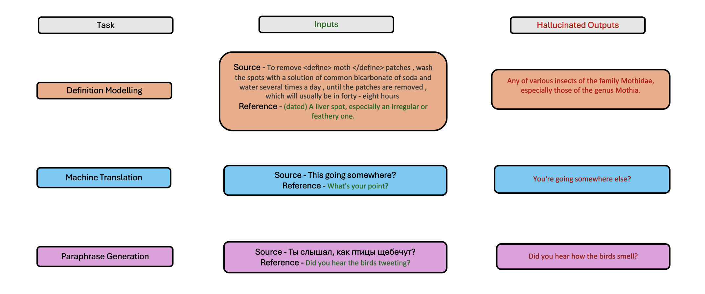
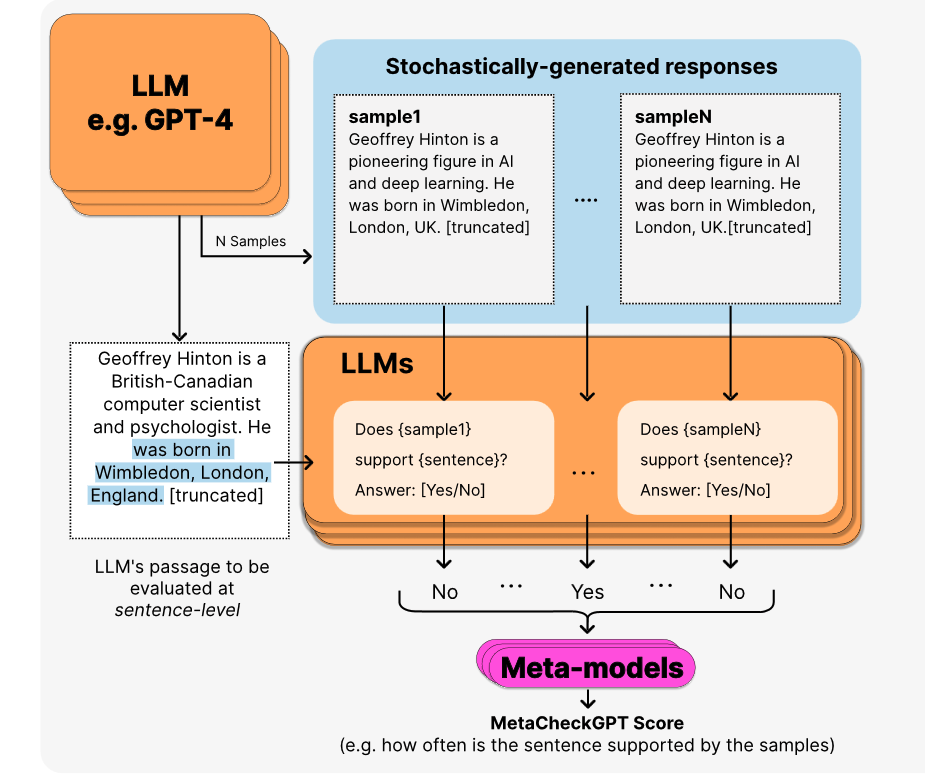

# MetaCheckGPT: SemEval-2024 Task 6 on Hallucination Detection in Large Language Models

The Halu-NLP team from various prestigious institutions has devised MetaCheckGPT, a cutting-edge solution that clinched the top spots in the SemEval-2024 Task 6. This task, named SHROOM (Shared-task on Hallucinations and Related Observable Overgeneration Mistakes), aimed at identifying hallucinations in large language models (LLMs). Our approach integrates meta-regressor frameworks and experiments with transformer-based models and black-box methods, achieving success in both model agnostic and model aware tracks.

## Problem Statement <!--- do not change this line -->

LLMs often produce hallucinated content, presenting major reliability issues. The challenge was to develop a method capable of detecting such hallucinations effectively across different tasks, including machine translation, paraphrase generation, and definition modeling.

## Key Results <!--- do not change this line -->

Our solution achieved first and second ranks in the model agnostic and model aware tracks, respectively. We showcased the efficacy of our meta-regressor framework by surpassing traditional hallucination detection methods. This framework leverages uncertainty signals from a variety of LLMs, improving detection robustness.

## Methodologies <!--- do not change this line -->

We introduced a novel meta-regressor model that evaluates and integrates outputs from multiple LLMs. This process involves comparing LLM-generated sentences against stochastically generated responses, with a meta-model evaluating the outputs. The methodology emphasized the importance of diversity in base models to capture a broader range of hallucination indicators.

## Data Sources <!--- do not change this line -->

For our experiments, we utilized datasets provided by the SHROOM organizers, encompassing tasks like definition modeling, machine translation, and paraphrase generation. The datasets and code for our approach will be available at our GitHub repository: [MetaCheckGPT at GitHub](https://github.com/rahcode7/semeval-shroom).

## Technologies Used
- PyTorch
- OpenAI API
- Google CoLab GPU resources

## Authors
For further information, feel free to contact us:
- Rahul Mehta: [rahul.mehta@research.iiit.ac.in](mailto:rahul.mehta@research.iiit.ac.in)
- Andrew Hoblitzell: [ahoblitz@purdue.edu](mailto:ahoblitz@purdue.edu)
- Jack O’Keefe: [jackokeefe2024@u.northwestern.edu](mailto:jackokeefe2024@u.northwestern.edu)
- Hyeju Jang: [hyejuj@iu.edu](mailto:hyejuj@iu.edu)
- Vasudeva Varma: [vv@iiit.ac.in](mailto:vv@iiit.ac.in)

